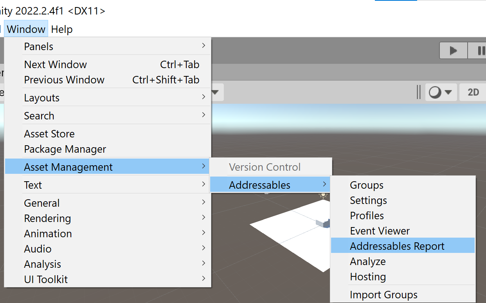
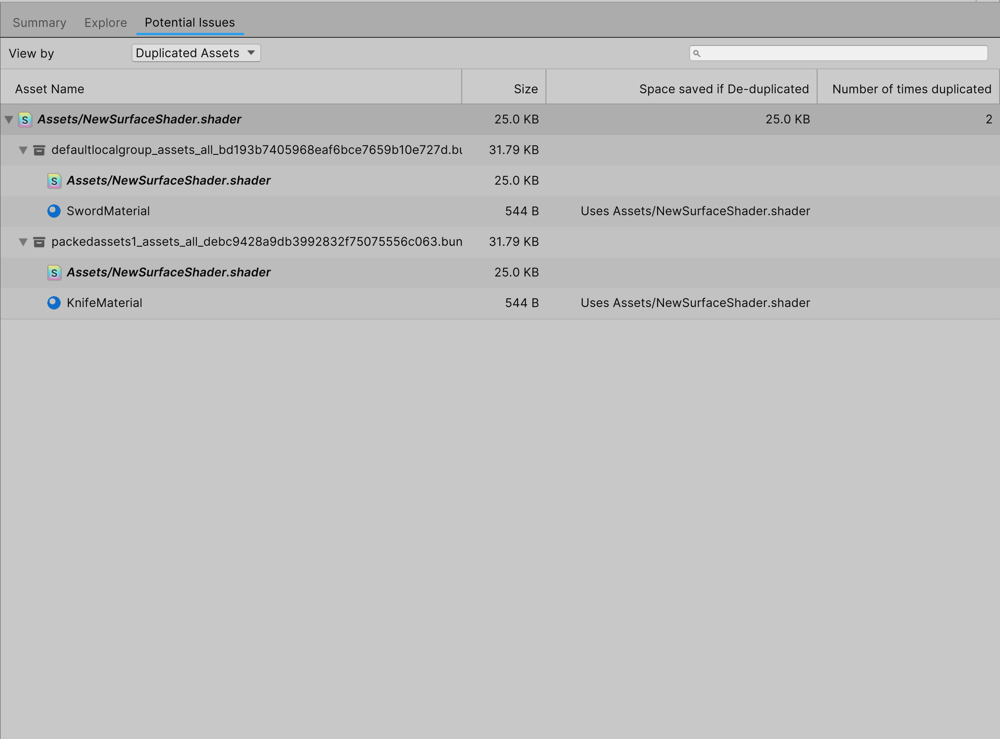

# Addressables Report

The Addressables Report is a tool introduced in Addressables version 1.21.8 that allows you view in depth the content built in an Addressables Build.

## Requirements

* The Addressables Report requires you use a Unity Editor version 2022.2 or greater. The option to open the report will not be visible on lower versions of the editor.
* If you wish to use the Addressables report, but your current Editor version is below 2022.2, it is possible to take a build report built on an earlier version of the Unity Editor and import it into a project that is using an Editor Version greater than 2022.2, provided that the build report in question was build on a version of Addressables greater than 1.21.8.
* The Addressables Report also requires access to a build report generated by an Addressables build to function. To enable the generation of build reports, Navigate to Edit > Preferences > Addressables and enable "Debug Build Layout". Additionally, you can enable the setting Open Addressables Report After Build, also located under Edit > Preferences > Addressables to make it so that the Addressables Report window will automatically open following every Addressables Build.

# Opening the Addressables Build Report

Opening the Addressables Build Report is done by navigating to Window > Asset Management > Addressables > Addressables Report

# Overview

The Addressables report window is broken into three primary views - The Summary View, The Explore View, and the Potential Issues View. You can switch between these three views by clicking the tabs along the top of the Addressables Report window.
* The Summary View contains high level information about the build and its contents.
* The Explore View contains in depth information about all of the content built as part of the Addressable build currently being viewed.
* The Potential Issues View scans the current build report for issues that may hamper build performance or otherwise be undesirable.

Alongside the three main content views, the Addressables Report also has two sidebars. The left side bar contains the list of all build reports currently detected within the project. Selecting a build report in the left side bar will load it in the Addressables Report.

The Right sidebar is an inspector that can be used to view more in depth info on an Asset or AssetBundle while viewing information within the Explore or Potential Issues views.

# The Summary View

The Summary view contains general information about the current build report being viewed, along with information about any potential issues that might be detected within the build. This information includes the locations of the catalogs created by the build, what profile the current build was built using, how long the build took, and the version of both Addressables and the editor that the build was created using.

Additionally, the Summary view contains some high level, aggregated information about the build, including the number of bundles created as part of the build, the size of the bundles built, and the number of assets in the build.

Of particular note in the Summary view is the count of Assets pulled into the build by an Addressable asset. This is the case for assets that are referenced by an Addressable asset, but that are not marked addressable themself. These assets must be pulled into the build to allow for the asset that depends on them to be loaded. Note that if multiple addressable assets in different bundles rely on the same, non addressable asset to be loaded, then that non addressable asset will be duplicated in multiple bundles. For more information about this, see the section on the Duplicated Assets View.

# The Explore View

The Explore view contains in depth information about the current build report being viewed. Using the View By dropdown, you can also change the way that assets are organized in the build report.

The Explore view can be viewed by four different item types:
* AssetBundles (Default): Views all AssetBundles built as part of the Addressables build. Expanding an AssetBundle shows the assets contained within.
* Assets: Views all Assets built as part of the Addressables build. Expanding an Asset shows all Assets and Bundles that depend on the asset.
* Labels: Views all of the Assets built as part of the Addressables build, organized by the label attached to the Asset. Expanding an asset shows the Assets and Bundles that depend on the asset.
* Groups: Views all of the AssetBundles built as part of the Addressables build, organized by which Group generated the bundle. Note that if using the Pack Together By Label or Pack Separately group settings, it is possible for multiple AssetBundles to be generated by a single group.

Additionally, it is possible to search within the Explore and Potential Issues view by typing in the search bar in the top right. Doing so will filter all assets in the current view by the name written in the search bar.

# The Inspector Panel

The Inspector Panel allows you to view more in depth information about any given Asset or Asset Bundle within the explore view. Left clicking on an Asset or Asset Bundle within the Explore view will open up the inspector panel.

The Inspector panel is itself comprised of two main parts: The Summary panel and the References panel.

The Summary Panel provides a single place to look at various pieces of information about an Asset or AssetBundle, such as its file size, the group that contains it, and any labels that may be associated with it. Additionally, the summary panel has buttons that can be used to navigate to various places within both the Build Report and the Editor, depending on whether an Asset or an AssetBundle is selected.

These buttons are:
* Select in Editor: Selects the Asset in the Unity Editor.
* Select in Group: Selects the currently selected asset in the Groups view in the Explore window. This will navigate to the Groups view if you're not currently in it.
* Select in Bundle: Selects the currently selected asset in the AssetBundles view in the Explore window. This will navigate to the AssetBundles view if you're not currently in it.
* Search in this view: Searches the name of the asset in the search bar.

# The References Panel

The References panel provides a means by which to see the chain of dependencies surrounding a given asset.

* The References To tab contains a list of all of the Assets and Asset Bundles that the selected item depends on. For example, if you have a material that references a given shader, when selecting the material in the explore view the shader will appear in the References To tab.
* The References By tab contains a list of all of the Assets and Asset Bundles that depend on the selected item. Taking the same example as before, if you have a material that references a shader, when selecting that shader in the explore view the material that references it will appear in the References By tab.

Clicking on the arrow next to an Asset or AssetBundle shown in the References panel will navigate you through the dependencies of the top level asset. For example, in the image above, Knife.Prefab has a reference to the bundle packedassets1_assets_all, and selecting the arrow would show which asset in the bundle generates the dependency.

The question mark icon is shown next to assets that are not addressable but are pulled into the bundle by an Addressable another asset. Clicking it will highlight all of the assets in the same bundle that reference that asset.

# The Potential Issues View

The Potential Issues Tab scans your build report for any potential issues or problems that may have arisen as part of your build and allows you to see and understand how these issues may have arisen, similar to Addressables Analyze rules. Currently, there is only one view present within the Potential Issues View.

The Duplicated Assets View allows you to see a list of all of the non addressable assets that are duplicated between multiple bundles in your build. This often happens when two addressable assets are in different bundles, but both reference a common asset that is not marked as addressable, leading it to be duplicated in both bundles. This kind of issue can be fixed by either moving the addressable assets in question into the same bundle, or by making the asset that is duplicated addressable. Either means of fixing it will have implications on your build dependencies, so making a choice that minimizes the impact on having the asset duplicated is preferred.

