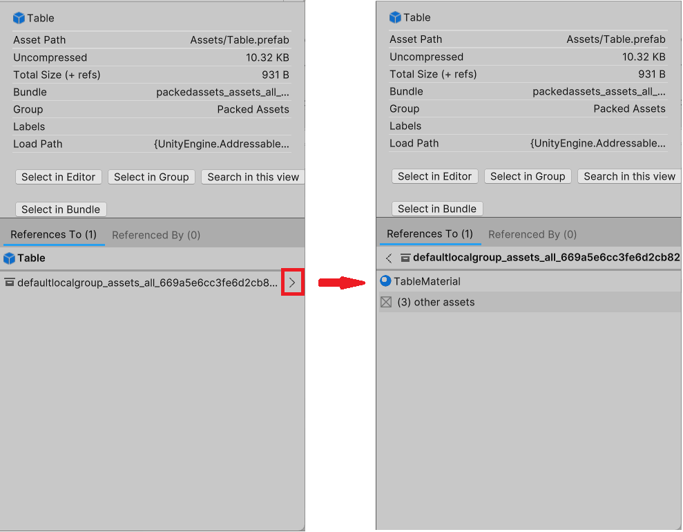

# The Inspector Panel

The Inspector Panel allows you to view more in depth information about any given Asset or Asset Bundle within the explore view. Left clicking on an Asset or Asset Bundle within [the Explore Tab](AddressablesReportExploreTab.md) or [the Potential Issues Tab](AddressablesReportPotentialIssuesTab.md) will update the inspector panel with the selected Asset or AssetBundle.

The Inspector panel contains two main sections: The Summary Panel and the References Panel.

The Summary Panel provides a single place to find information about an Asset or AssetBundle, such as its file size, the group that contains it, and any labels that may be associated with it. Additionally, the summary panel has buttons that you can use to navigate to various places within both the Build Report and the Editor, depending on whether an Asset or an AssetBundle is selected.

These buttons are:
* Select in Editor: Selects the Asset in the Unity Editor.
* Select in Group: Selects the currently selected asset in the Groups view in the Explore window. This will navigate to the Groups view if you're not currently in it.
* Select in Bundle: Selects the currently selected asset in the AssetBundles view in the Explore window. This will navigate to the AssetBundles view if you're not currently in it.
* Search in this view: Searches the name of the asset in the search bar.

# The References Panel

The References panel displays the chain of dependencies surrounding a given asset.

* The **References To** tab contains a list of all of the Assets and AssetBundles that the selected item depends on. For example, if you have a material that references a shader, then the shader appears in this tab when you select the material in the Explore View.
* The **Referenced By** tab contains a list of all of the Assets and AssetBundles that depend on the selected item. For example. if you have a material that references a shader, then the material that the shader references appears in this tab when you select the shader in the Explore View.

Select the arrow next to an Asset or AssetBundle shown in the References panel to cycle through the dependencies of the top level asset. For example, in the image above, **Table** has a reference to the bundle **defaultlocalgroup_assets_all...**. Selecting the arrow shows that the asset that generates this dependency is **TableMaterial**, and that the **defaultlocalgroup_assets_all...** bundle also contains three other assets that are not dependencies of **Table**.

The question mark icon is shown next to assets that are not addressable but are pulled into the bundle by an Addressable another asset. Clicking it will highlight all of the assets in the same bundle that reference that asset.
